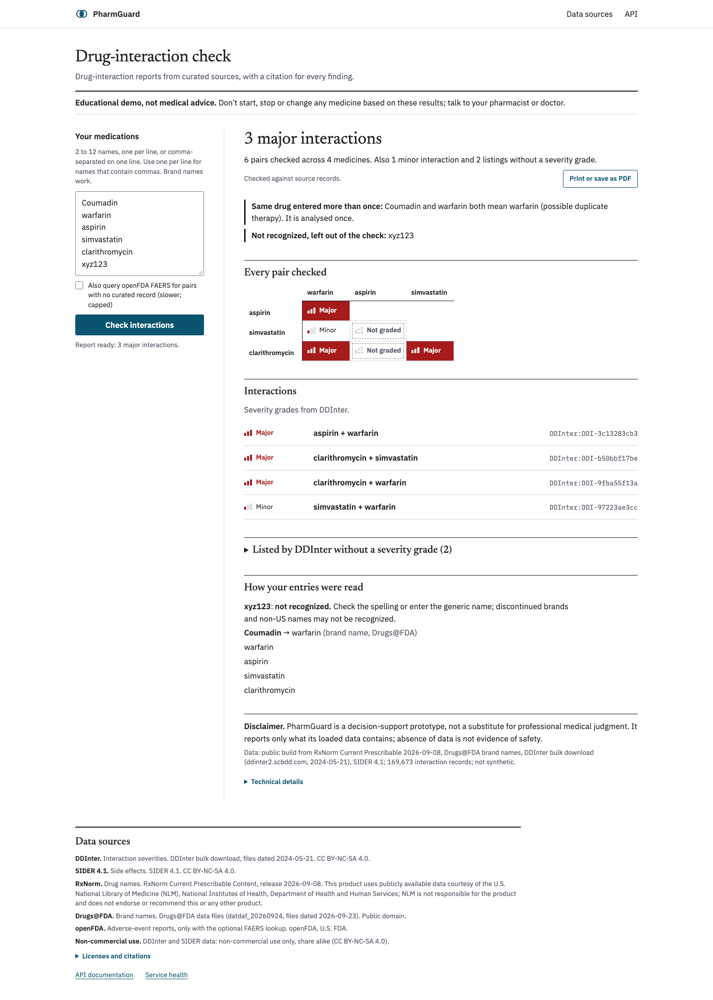
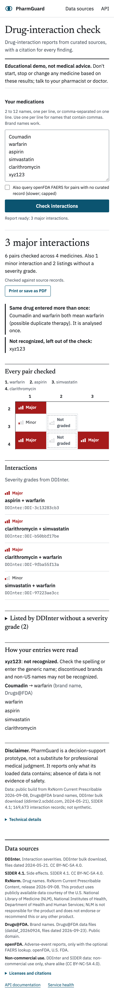
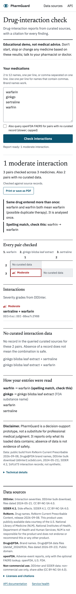
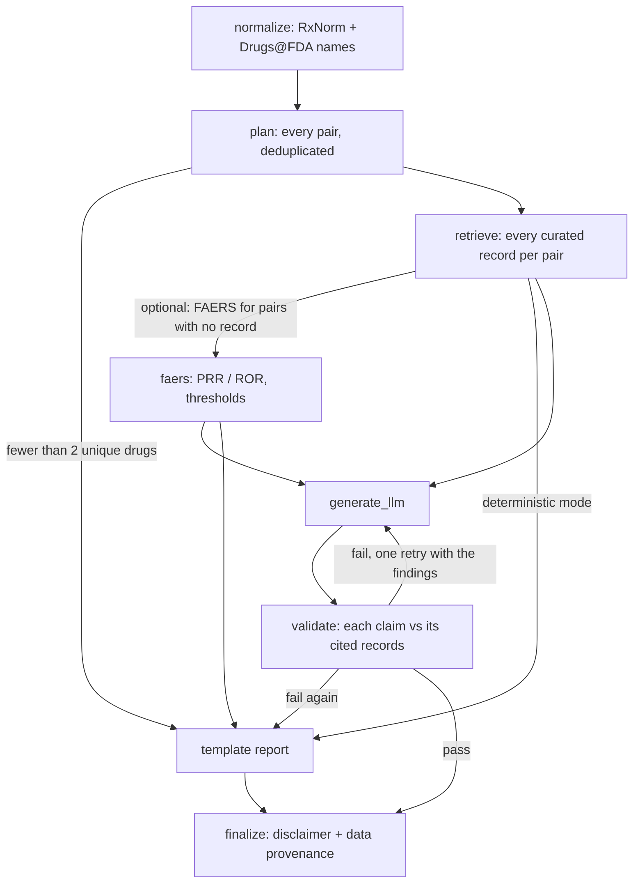

# PharmGuard

A drug-interaction checker that cites a source record for every finding and says what it couldn't check.

**Live demo: [https://pharmguard.web.app](https://pharmguard.web.app)**

PharmGuard is a RAG system with deterministic planning. Enter 2 to 12 medicines (generic names, brands, even
misspellings) and it:
1. reads each name against RxNorm and Drugs@FDA;
2. checks **every** pair against curated interaction data (DDInter);
3. returns a report where each finding carries its DDInter severity and a record ID.

Names it can't read, ambiguous names, combination products and pairs with no curated record are listed rather
than dropped. "No data" is never presented as "safe".

The orchestration is a LangGraph state machine with deterministic planning and bounded LLM retry. An LLM can
write the report's prose, but every draft is checked claim by claim against the records it cites. A draft that
fails twice is replaced by the deterministic template report. The live app runs the template path; no LLM is
configured there.

> Educational prototype, not medical advice. Severity grades are DDInter's, and interaction references disagree
> with each other (see [Limitations](#limitations)).



<p align="center">
  
  
</p>

## How it works



The full diagram is [docs/graph.md](docs/graph.md), generated from the code; the design is in
[docs/ARCHITECTURE.md](docs/ARCHITECTURE.md).

## Results

All from running the code in this repo. Each result file names the data build and its provenance sha256; see
[docs/EVALUATION.md](docs/EVALUATION.md) for methods and caveats.

| Check | Result | Build |
|---|---|---|
| Holdout: 10% of DDInter pairs removed; how many go unreported? | **0 of 16,966** (all declared as no data, or shown from another source) | public, research |
| FDA-label reference set (openFDA labels, checked automatically; heuristic wording classes) | **23 of 23** label-backed interactions found with a DDInter grade; 0 graded below the label; 8 unclear rows excluded | public |
| Could a TWOSIDES PRR replace a curated grade? | No: linear-weighted **κ 0.002** vs DDInter on held-out pairs | research |
| Checker false positives on clean template reports | **0** findings over 57 case reports, 200 random lists and 27 hard names | public |
| Orchestration under scripted faults | **100%** of 11 invariants over 806 runs; **6 of 6** seeded bugs caught | public |
| Hand-labelled pairs retrieved | **37 of 37** | public |
| Live latency, six-drug check, end to end (web.app) | p50 **174 ms**, p95 236 ms (n = 38); cold start 15.7 s | live |
| LLM faithfulness, first-draft pass rate, judge agreement | **—** (not yet run) | — |
| Pharmacist review | **—** (protocol ready, not yet done) | — |

Numbers come from [results/](results/) and [docs/DEPLOYMENT.md](docs/DEPLOYMENT.md).

## Run it locally

Python 3.11+ (the Docker image uses 3.11).

```bash
python -m venv .venv && source .venv/bin/activate
pip install -r requirements.txt
python scripts/ingest_data.py --sample                   # synthetic sample data (85 records), no downloads
python -m pytest -q                                      # offline, no API keys
python scripts/demo.py lisinopril spironolactone aspirin fictional_drug_xyz
streamlit run app/streamlit_app.py
```

With real data (about 113 MB of downloads; sources and licenses in [docs/DATASETS.md](docs/DATASETS.md)):

```bash
python scripts/fetch_data.py                             # RxNorm, Drugs@FDA, DDInter, SIDER, sha256-pinned
python scripts/ingest_data.py --full --profile public
PHARMGUARD_DATA_DIR=data/profiles/public python scripts/demo.py Coumadin Diflucan
python -m pytest -q --run-realdata
```

The LLM path is optional. Set one of `ANTHROPIC_API_KEY`, `OPENAI_API_KEY` or `GOOGLE_API_KEY` in `.env` (see
`.env.example`); `python scripts/run_llm_eval.py --plan` shows what an evaluation run would call.

## Run the API in Docker

```bash
docker build -t pharmguard-api .
# with a local public build:
docker run --rm -p 7860:7860 -v "$PWD/data/profiles/public:/data/public:ro" pharmguard-api
# or let it download and verify the published public build:
docker run --rm -p 7860:7860 \
  -e PHARMGUARD_HF_DATASET=shwetanshu2211/pharmguard-public-build \
  -e PHARMGUARD_HF_REVISION=a7b844d0d71994670f89d723fe5577e142e4c10e \
  -e PHARMGUARD_HF_PROVENANCE_SHA256=fc037dc5f67b9c0dd05c4664e48a4888a155d285dc0e1a11369fc971dab31073 \
  pharmguard-api
open http://127.0.0.1:7860/            # the page; /docs for the OpenAPI UI
```

Without a verified build, the server stays up but fails closed. `POST /v1/check` takes
`{"drugs": [...]}`; see [docs/API.md](docs/API.md). Deployment (Cloud Run behind Firebase Hosting, costs, rate
limiting) is in [docs/DEPLOYMENT.md](docs/DEPLOYMENT.md).

## Limitations

- **Severity grades are DDInter's.** PharmGuard doesn't reconcile references, and references disagree widely.
  In one comparison of three major resources, 78% of the drug pairs they list appeared in only one of them
  ([Kontsioti et al., 2022](https://www.ncbi.nlm.nih.gov/pmc/articles/PMC9545693/)). Against FDA labeling,
  DDInter grades 10 of 23 verified pairs higher than the label's wording.
- **Pairwise only.** A risk that needs three drugs together (NSAID + ACE inhibitor + diuretic) isn't flagged as a
  combination.
- **No mechanisms.** The DDInter bulk files have no mechanism text, so reports don't explain why a pair interacts.
- **The checker is a lower bound.** Its mechanism, event and population checks use hand-written lexicons, so
  fabrications worded outside them pass. The LLM judge that would add a second layer is built but hasn't run on
  a real model yet.
- **Many ungraded listings.** DDInter lists many pairs without a grade, including all 10 negative controls in
  the reference set. The report keeps them under their own heading.
- **Small references.** The FDA-label set is 33 scored rows, classified by keyword rules. There's no
  clinician review yet.

## Documentation

| | |
|---|---|
| [docs/ARCHITECTURE.md](docs/ARCHITECTURE.md) | components, graph, data builds, serving |
| [docs/EVALUATION.md](docs/EVALUATION.md) | every measurement, with definitions and limitations |
| [docs/DATASETS.md](docs/DATASETS.md) | sources, versions, licenses, processing, attribution |
| [docs/API.md](docs/API.md), [docs/DEPLOYMENT.md](docs/DEPLOYMENT.md) | the service and the live deployment |
| [docs/OBSERVABILITY.md](docs/OBSERVABILITY.md) | optional tracing (Phoenix, LangSmith), redacted by default |
| [docs/PHARMACIST_REVIEW_PROTOCOL.md](docs/PHARMACIST_REVIEW_PROTOCOL.md) | the planned clinician review |
| [docs/appendix/sample_case.md](docs/appendix/sample_case.md) | one case: its evidence next to its report |
| [examples/](examples/) | reports for 9 scenarios on the public build |

## License

The code is MIT-licensed (see [`LICENSE`](LICENSE)). The data has its own licenses:

- The public build is derived from DDInter and SIDER and is licensed **CC BY-NC-SA 4.0** (non-commercial use;
  share alike).
- RxNorm (U.S. National Library of Medicine) and Drugs@FDA (U.S. FDA) are public domain, with the attribution
  NLM and the FDA ask for.
- TWOSIDES has no stated license and is used only in a local research build; nothing derived from it is
  published.

Citations, license notices and the attribution text are in [`docs/DATASETS.md`](docs/DATASETS.md).
