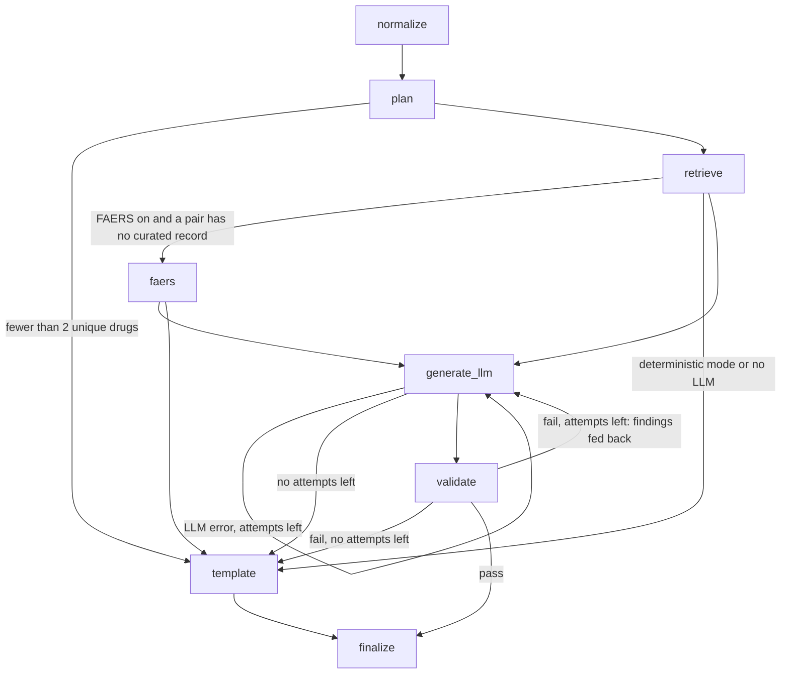

# PharmGuard architecture

PharmGuard is a RAG system with deterministic planning. Given 2 to 12 drug names, it reads each name, checks
every pair against curated interaction data, and writes a report in which every clinical claim cites a source
record. The orchestration is a LangGraph state machine with deterministic planning and bounded LLM retry. The
LLM is optional: without one, or whenever an LLM draft fails the checker twice, PharmGuard returns a
deterministic template report. The template path is what the live app serves.

## Principles

1. **Lookup, not similarity search, for pair questions.** "Do A and B interact?" is an exact-key lookup on a
   canonical pair. There is no vector store.
2. **Deterministic where the answer is closed-form.** Pair enumeration, record selection, severity labels and
   the report structure are code. The only LLM step is the wording of the report, and it is checked.
3. **Gaps are outputs.** Unrecognised or ambiguous names, combination products, pairs with no curated record and
   hidden statistical signals are listed in every report. "No data" is never written as "safe".
4. **Severity comes from the source.** Severity headings hold curated DDInter grades only. Statistical signals
   (TWOSIDES, research build only; FAERS, optional) appear in their own sections, with no severity words.
5. **Nothing unvalidated reaches the user.** Every LLM draft goes through the same checker used in evaluation.

## The graph

`src/graph/builder.py::build_graph` is the only place the topology is defined; `docs/graph.md` is generated from
it (`python scripts/draw_graph.py`, and a test fails if it is stale).

The state is a JSON-serializable dict. Every node appends `{node, status, ms, detail}` to an append-only
`trajectory`. `PharmGuardGraph(settings).run(drugs)` returns the final state: `report`, `report_structure` (the
template report as data), `report_source` (`deterministic`, `llm`, `llm_retry`, `deterministic_fallback` or
`deterministic_insufficient_input`), `final_validation`, `evidence`, `trajectory` and timings. Settings are an
explicit frozen dataclass (`src/graph/settings.py`); only `Settings.from_env()` reads the environment.

The graph's decision points (whether to retry, whether an error is transient, whether FAERS is needed) are small
module-level functions in `builder.py`. That lets the trajectory evaluation seed bugs into them
(`src/evaluation/seeded_bugs.py`) and check that its invariants catch every one.

## Nodes

| Node | Code | What it does |
|---|---|---|
| normalize | `src/input_validation.py`, `src/data/normalizer.py` | Validates names (at most 150 characters, a restricted character set, no control characters). Then resolves each: exact alias (RxNorm ingredient, salt forms, brands, FDA substance names, Drugs@FDA brands including discontinued ones), then a spelling match limited to drugs that have data (Levenshtein score ≥ 85, no rival within 10 points). Ambiguous names ("insulin", "Celebyx") and combination products (Percocet) stay unresolved, and the report lists the candidates or ingredients. The live RxNorm API fallback exists but is off on the API. |
| plan | `src/agents/planner.py` | De-duplicates by canonical name (Coumadin + warfarin is one drug, with a notice) and enumerates `combinations(sorted(names), 2)`. No LLM. |
| retrieve | `src/agents/retriever.py`, `src/retrieval/interaction_retriever.py` | A pair index built once at load. For each pair it keeps **every** curated record and at most 3 statistical signals (highest PRR), and states the rest as "+N more not shown". A pair with no record goes to `no_data_pairs`. |
| faers | `src/retrieval/faers_retriever.py`, `faers_stats.py` | Optional, only for no-data pairs. openFDA counts; PRR, ROR (95% CI) and Yates χ²; surfaces a signal only if it meets the Evans criteria, the ROR's lower bound is above 1, and neither drug explains it alone. Suppressed events are counted in the report. |
| template | `src/agents/report_structure.py` | Builds the report as a structure (entries, summary, findings by curated grade, ungraded listings, signals, coverage, FAERS), then renders markdown from it. The page renders the same structure. |
| generate_llm | `src/agents/generator.py`, `src/llm.py` | One call with the evidence block. Drug names are delimited as data; the prompt says when no record has mechanism text. Anthropic (`claude-sonnet-5`), OpenAI or Gemini (`google-genai`, `gemini-3.8-flash`). Code, not the model, adds "How your entries were read", the FAERS section and the footer. |
| validate | `src/verification/` | Parses the draft into claims and checks each against the records it cites (see docs/EVALUATION.md for the finding codes). A failing draft is retried once with the findings as feedback (`max_llm_attempts = 2`). Only transient errors are retried. |
| finalize | `builder.py` | Appends the disclaimer and the provenance data line exactly once, validates the final report, and records `report_source`. |

## Data

`scripts/fetch_data.py` downloads sha256-pinned sources; `scripts/ingest_data.py --full --profile public|research`
builds `data/profiles/<profile>/processed/` with a `provenance.json` (sources, versions, hashes, row counts,
match rates, a sha256 per processed file). See docs/DATASETS.md.

| Build | Contents | Used by |
|---|---|---|
| sample | 85 synthetic interaction records | tests and CI |
| public | RxNorm Current Prescribable + Drugs@FDA brands + DDInter bulk download + SIDER 4.1 | the live app |
| research | public + TWOSIDES (no license; never published) | local evaluation, aggregate numbers only |

## Serving

`api/` is a FastAPI service around the graph (docs/API.md). Graphs are built once at start-up. At start-up
`api/bootstrap.py` downloads the public build from a pinned Hugging Face dataset revision and checks
`provenance.json` and every file against pinned sha256 values. Without a verified build the server stays up and
fails closed (`/health` says why, `/v1/check` returns 503). Deterministic mode is the default; LLM mode needs a
client API key and a configured provider. Per-IP rate limit, a concurrency cap, timeouts, and logs without drug
names. The live deployment is Cloud Run behind Firebase Hosting (docs/DEPLOYMENT.md).

## Observability

Optional tracing to Phoenix or LangSmith, off by default, redacted by default, and never allowed to change a
report (docs/OBSERVABILITY.md).

## Evaluation tooling

| What | Code | Output |
|---|---|---|
| Hand labels, checker metrics, LLM path | `scripts/run_eval.py` | `results/eval_*.json` |
| All real-model numbers, with the judge | `scripts/run_llm_eval.py` | `results/llm_eval_<profile>.*` |
| Checker false positives and sensitivity | `scripts/validate_checker.py` | `results/checker_validation*` |
| Orchestration (step scoring, fault suite, invariants, seeded bugs) | `scripts/eval_trajectory.py` | `results/trajectory*` |
| Graceful degradation | `scripts/eval_holdout.py` | `results/holdout_*` |
| PRR tiers vs DDInter grades | `scripts/eval_severity_agreement.py` | `results/severity_agreement_research.*` |
| Alert burden | `scripts/eval_alert_burden.py` | `results/alert_burden_*` |
| FDA-label reference set | `scripts/verify_reference_labels.py`, `scripts/score_reference_set.py` | `results/reference_set_public.*` |
| FAERS thresholds demo | `scripts/demo_faers_signals.py` | `results/faers_signal_demo.md` |
| Pharmacist review | `scripts/export_pharmacist_cases.py`, `scripts/score_pharmacist_review.py` | `results/pharmacist_review.*` |

## Legacy pipeline

`src/pipeline.py` is the pre-LangGraph linear orchestrator (normalize → plan → retrieve → generate → validate,
with the template as fallback). It shares every component above and is kept for comparison (`--legacy` in
`scripts/demo.py` and `scripts/run_eval.py`, `PHARMGUARD_PIPELINE=legacy` in the Streamlit app).

## Limits of the design

- Pairwise only: a pattern involving three drugs at once is not flagged as a combination.
- No mechanism text: the DDInter bulk files have none, so a report can't explain *why* a pair interacts.
- Severity is DDInter's: other references grade some pairs differently (docs/EVALUATION.md).
- The checker is lexicon-based, so it catches the fabrications its lexicons know (a lower bound).
