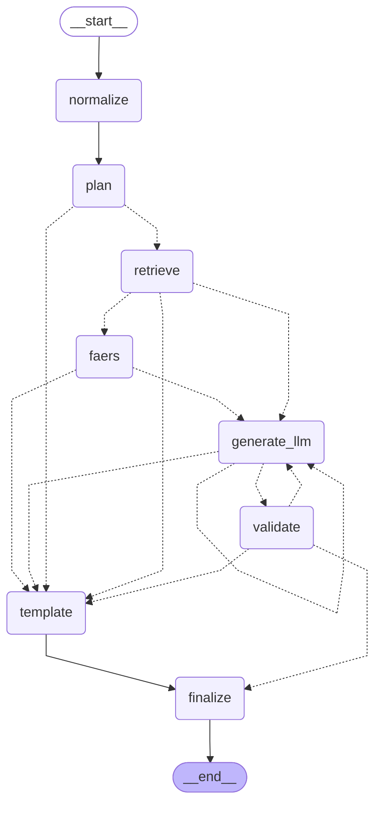

# PharmGuard graph

A LangGraph state machine with deterministic planning and bounded LLM retry
(`src/graph/builder.py`). Generated by `python scripts/draw_graph.py`; a test
fails if this file is stale. Dotted arrows are conditional edges:

- **plan**: fewer than 2 unique resolved drugs → `template`; otherwise `retrieve`.
- **retrieve**: FAERS enabled → `faers`; deterministic mode or no LLM configured → `template`; otherwise `generate_llm`.
- **generate_llm**: success → `validate`; LLM error with attempts left → `generate_llm`; none left → `template`.
- **validate**: pass → `finalize`; fail with attempts left → `generate_llm` (findings + rejected draft as feedback); none left → `template`.
- **finalize**: appends the disclaimer and provenance line, validates the final report, and records `report_source`.

